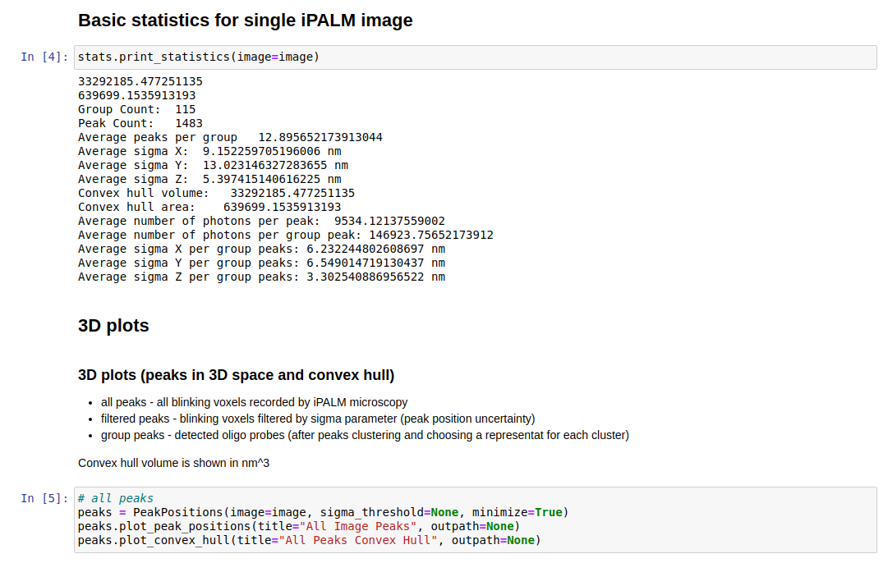
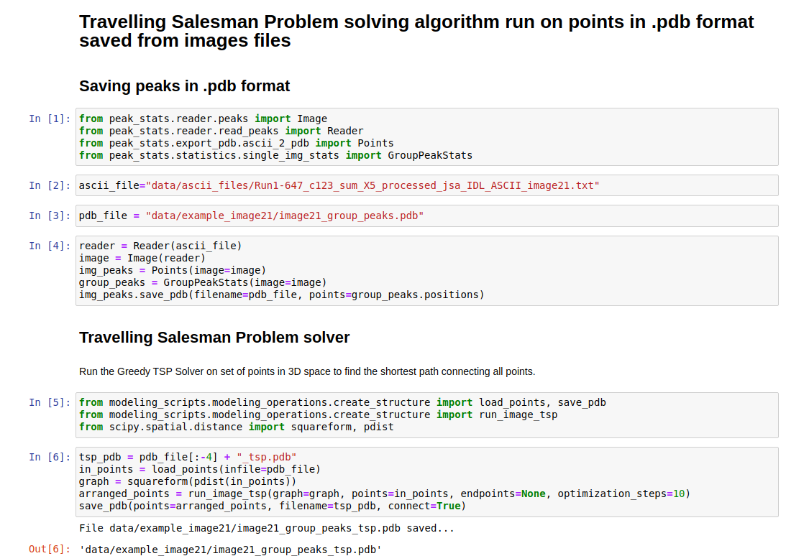

# ChromoLooping

Code and data in this repository comes from publication _Super-resolution visualization of chromatin loop folding in human lymphoblastoid cells using interferometric photoactivated localization microscopy_ 

You can use UCSF Chimera or any other viewer to visualize models and points in .pdb format.

 ## Installation Guide
 
 Requirements for Python packages can be found in **requirements.txt**
 
 Requirements:
 * Python 3.6 or later
 * [Jupyter Notebook](https://jupyter.org/install)
 * [UCSF Chimera](https://www.cgl.ucsf.edu/chimera/) or other visualization software 

The installation on desktop computer shouldn't take longer than 30 minutes.

The easiest way to run the code is to open Jupyter notebooks:

```bash
$ git clone https://github.com/SFGLab/ChromoLooping.git
$ cd ChromoLooping
$ jupyter notebook
```
 
 ...and select one of the two available **.ipnyb** files:
 * [statistics and image data processing](https://github.com/SFGLab/ChromoLooping/blob/main/image_statistics.ipynb)
 * [modelling pipeline](https://github.com/SFGLab/ChromoLooping/blob/main/image_driven_modeling.ipynb)
 
 The existing examples in Jupyter notebooks can also be viewed directly on GitHub.
 
 ## Jupyter Notebooks
 
 All examples of usage of the full processing pipeline step by step can be found in Jupyter notebooks. In notebook **image_statistics.ipynb** you can find 
 all the operations on ASCII files with image peaks exported from PeakSelector:
 * reading and processing iPALM data from ASCII files 
 * statistics
 * plotting histograms
 * plotting convex hull  

  


 
 In **image_driven_modeling.ipynb** we put whole modeling procedure:
  * exporting image peaks to .pdb format
 * Traveling Salesman Problem solver
 * Spline interpolation
 * Calculating distance maps from 3D models
 * Distance maps visualization 
 
  
  
 This tasks do not require any heavy computations and running the examples in Jupyter notebooks shouldn't exceed 5 minutes on a standard desktop computer.
 ## Data
 The results from our work can be fully reproduced using the code from this repository. 
 
 All data files used in our publications are located in `data/ascii_files`.
  
 All models obtained from our iPALM imaging are in `data/3d_models`. The models are in .pdb format and can be opened via USCF Chimera software.

example:

```bash
$ cd data/3d_models
$ chimera image7_smooth3331.pdb
```

The model will look like this:
  

To get the presentation of the model as in our publication open the command line `Favorites > Command Line` and type two commands:
```bash
setattr m stickScale 8
rainbow
```
Then you can rotate the model to desired orientation. The final result will look like this:

  


 The example output data of full reconstruction of the image processing and modelling pipeline is located in `data/example_image_21`.
 